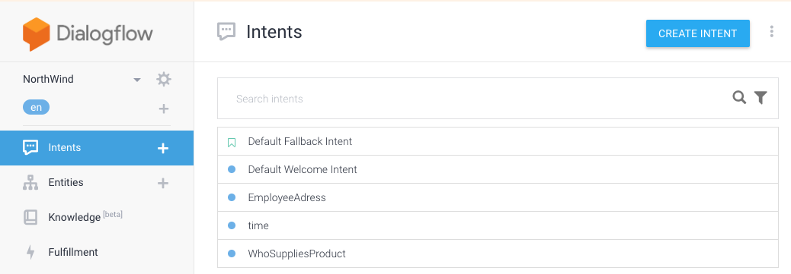
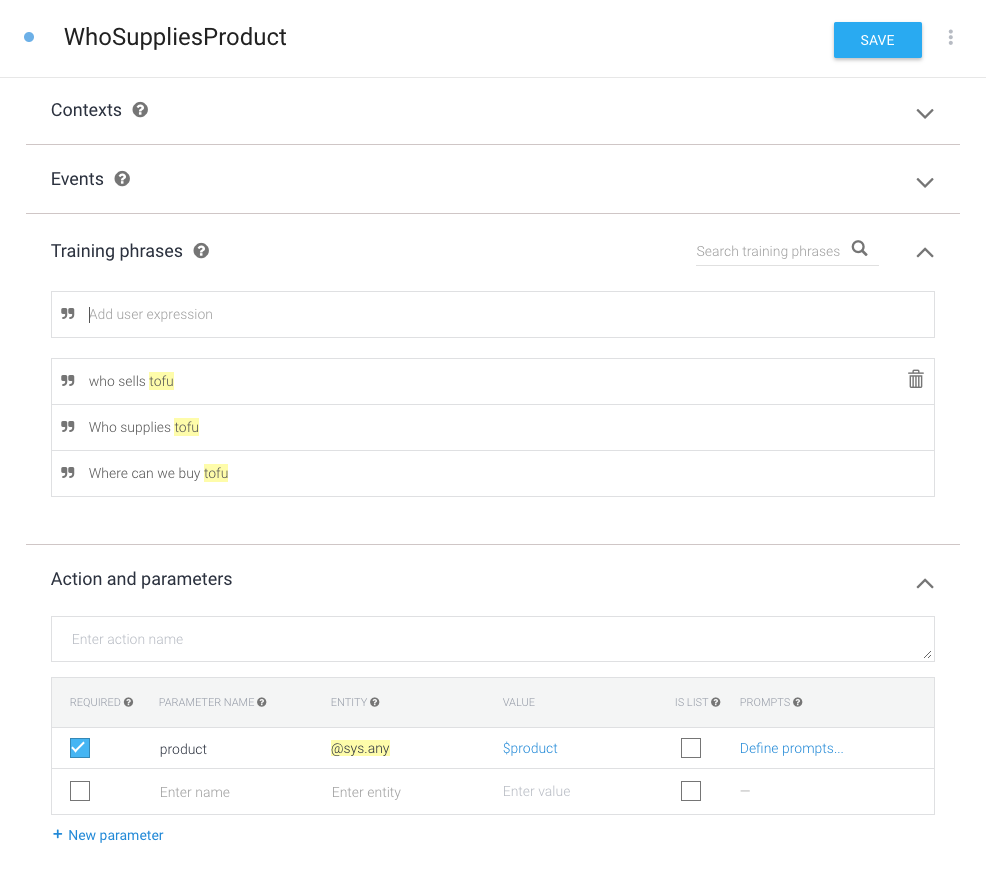
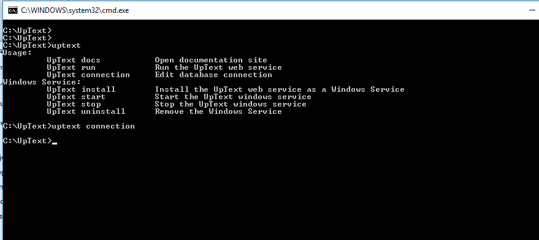
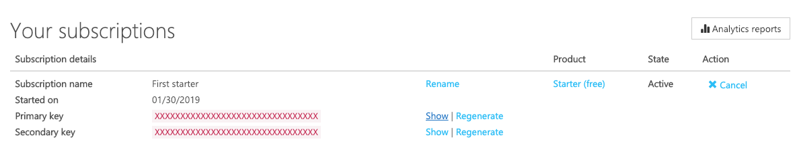
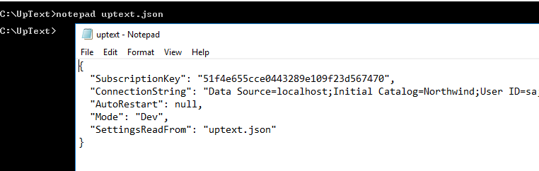
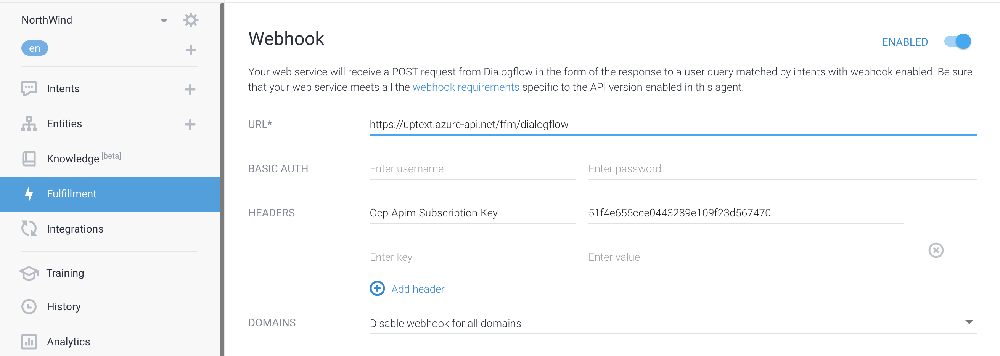
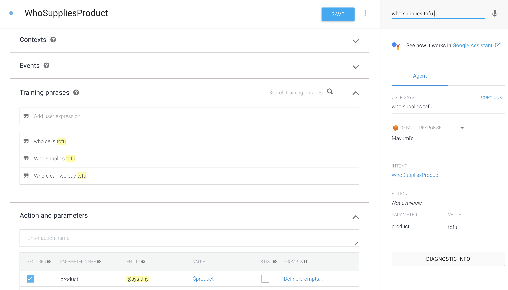

# SQL Server connection for Dialogflow


Working with Dialogflow is easy until you actually have to implement the users intent.  

UpText lets you write the intent as a Stored Procedure on the SQL Server. 

Our tool creates the webhook needed for DialogFlow. A message is sent to a client app on your machine which calls the procedure and returns results to the user. 

You do not need to open any firewalls or buy a SSL certificate. The only requirement is a local Windows PC.

The tool will create an empty stored procedure when running in developer mode.

In production the connector may be installed as a Windows Service.

Let us walk through a complete example

### Create Dialogflow agent

Start a new Dialogflow agent in the 
<a href="https://console.dialogflow.com" target="_blank">Dialogflow console</a>

Below we have created the NorthWind agent and added the intent "WhoSuppliesProduct"



We give Dialogflow some training sentences. "Tofu" is a parameter. We name the parameter "product".



Dialogflow can now understand different phrases which all means:

    Tell me the name of the company that supplies tofu.

We need to tell Dialogflow where to find a service that will fulfill the users intent. 

### Register on Uptext Portal

UpText needs your name and email. You can sign up 
[here](https://uptext.portal.azure-api.net/signup/)


### Install local app

After installation open a command prompt to the UpText folder.


Use the command uptext connection to update your database connection string. 

### Get a UpText subscription key

You get a subscription key when you subscribe to a product. Go 
[here](https://uptext.portal.azure-api.net/products)

When you have a subscription click on "Show" and copy the key.



On the command line open uptext.json



Update the subscription key and save.

### Start local app

Go to the command prompt and type:

```bash
    uptext run
```

###Add WebHook to Dialogflow



In Dialogflow Console enable the webhook. Enter these values:

```
    URL:        https://uptext.azure-api.net/ffm/dialogflow
    Header key: Ocp-Apim-Subscription-Key
    Key Value:  <Subscription Key from UpText>
```

With this information Dialog flow will ask the WebHook to fulfill the users intent. The cloud endpoint will then use the subscription key to route the call to the UpText connector running on your machine. It will then call the Stored Procedure on your local machine. 

###Enable fulfillment for intent

Go back to the WhoSuppliesProduct intent. In the bottom of the page open the Fulfillment section and select

    Enable webhook call for this intent

On the the top right of the page you can test the agent. Type

    who supplies tofu

Dialog flow will recognize this as a call to the WhoSuppliesProduct intent with tofu as the product parameter. The UpText connector tries to find a stored procedure named:

    ffmWhoSuppliesProduct

Since this procedure does not exist it will create an empty procedure:

```sql
ALTER PROCEDURE[dbo].[ffmWhoSuppliesProduct]( 
	@product VARCHAR(max) = NULL,
	@responseText VARCHAR(max) out
)
AS
	SELECT @responseText = 'Default response from ffmWhoSuppliesProduct' 
```

Open the procedure and change the implementation to something like:

```sql
ALTER PROCEDURE[dbo].[ffmWhoSuppliesProduct]( 
	@product VARCHAR(max) = NULL,
	@responseText VARCHAR(max) out
)
AS
	DECLARE @productId int = null
	SELECT @productId = max(ProductId) FROM Products 
        WHERE ProductName like   @product + '%'
	IF @productId IS NULL
		SELECT @responseText = 'Sorry cannot find product: ' + ISNULL(@product,'')
	ELSE
	BEGIN
		SELECT @responseText = CompanyName FROM Suppliers 
			INNER JOIN Products ON Suppliers.SupplierID = Products.SupplierID 
									AND Products.ProductID = @productId
	END
```

Try again in Dialogflow console. Hopefully you will get the tofu supplier, Mayumi's





### Add functionality

Now that your setup is working, adding more intents is simple with the Dialogflow console. Add several training phrases and mark the parameters needed. 

Test the intent without a webhook and then try it out.

Set the "Use Webhook" for the intent and try it. On your SQL Server find the empty procedure and add its implementation. 

